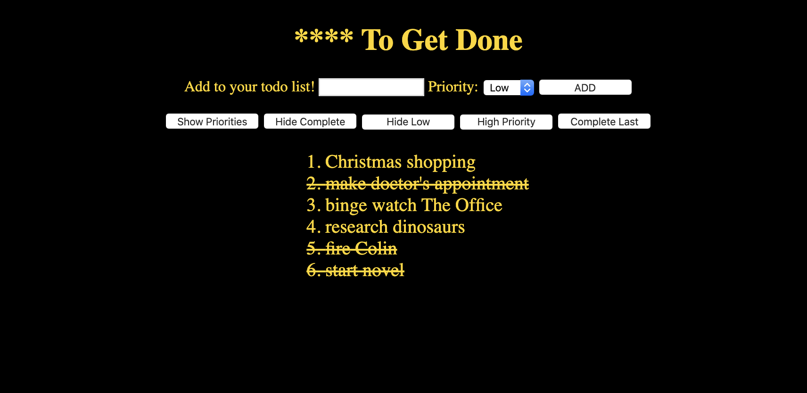

# ToDo List

ToDo List is an application that allows it's users to organize all of things that need to get done in their lives!

# What it looks like 
 

# The app's features

The following features are available in this app:

* Enter text and click 'add' to enter a new todo to the list.
* Set the priority of each tasks.
* Click on a task to mark it as complete by adding a line through the text.
* Show only the tasks that are not complete yet.
* Show only high priority tasks.
* Move completed tasks to the bottom.
* Move high priority tasks to the top.

# Tools and techniques used 
Each feature for the user was created by adding event listeners to the buttons that call certain functions when clicked.    

These functions were written using three primary methods:  
1. Map
2. Filter
3. Sort

  Basic HTML was used and classes were added for DOM manipulation using documentQuerySelector.    

  The styling was added using simple CSS properties with some additional flexbox features for layout.  

  None of these tools were new to me as we have excellent instructors that walked us through each of these methods on previous assignments.   

# Where the app is hosted.  
No need to download this application. It is currently being hosted at https://hurl2526.github.io/todata/ for anyone to use!

# Contributors

@hurl2526 📖

Also a special thanks to classmates and instructors for inspiration and guidance with completing this project!

### Contact
If you want to contact me you can reach me at patrick.hurley@codeimmersives.com

